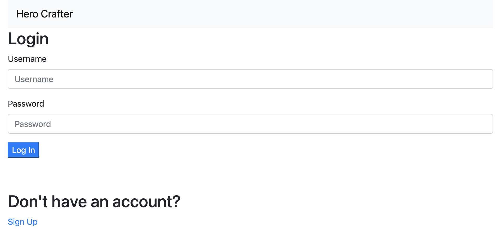
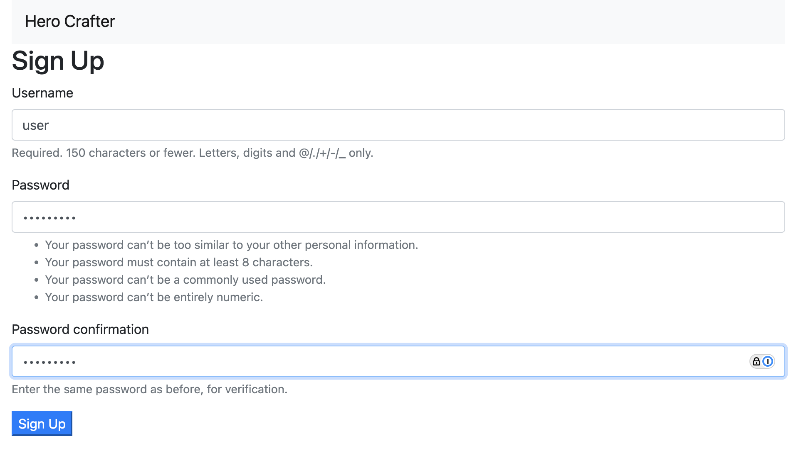
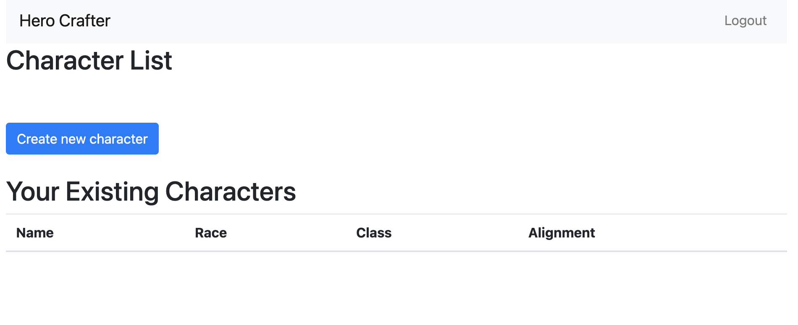
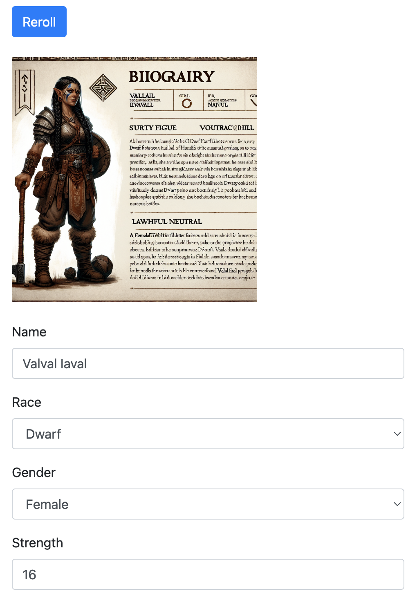
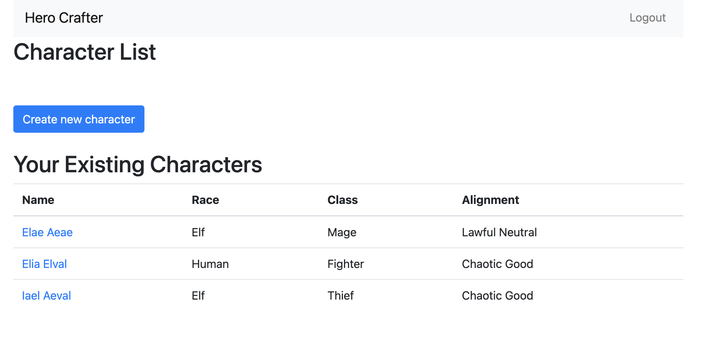
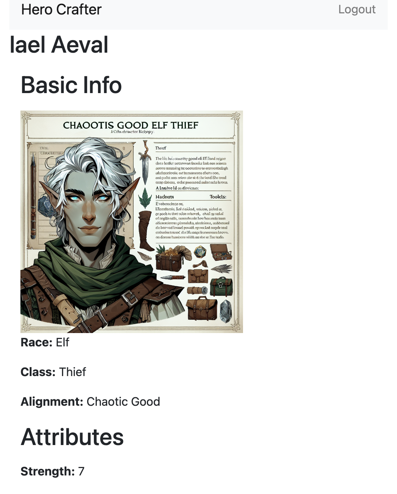
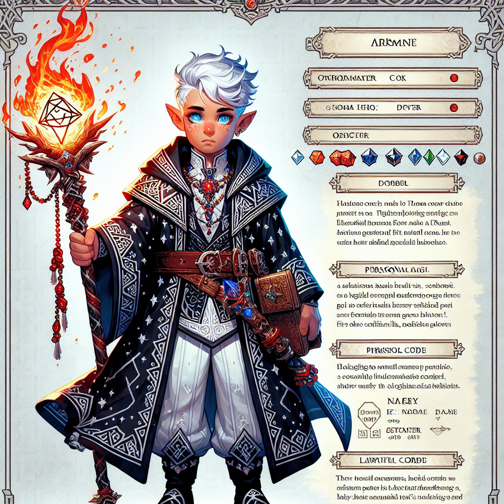

# HeroCrafter

A Django app for creating RPG characters with help of AI.

## Prerequisites

You will need an OpenAI token (the app uses its API to generate character biographies and portraits).

The OpenAI token must be written in the `.env` file in the same folder as this `README.md`.

Another thing that must be in `.env` is the PostgreSQL password (PostgreSQL is used for storing characters and
user data).

The format of the `.env`:

```
OPENAI_API_KEY=mykey123
POSTGRES_PASSWORD=mypassword
```

## How to Run

To run the app locally, you need Docker Compose.

Please make sure you have created the `.env` file as described in the previous section.

Now, to run the app do

```shell
docker-compose up
```

Wait until the app starts.

The web interface should be now visible by http://127.0.0.1:8000/.

If everything is OK, you will see the login screen:



Since we don't have an account yet, click the "Sign Up" link in the bottom. 

## Signing up

On the sign-up screen enter the username and password and click "Sign Up". 



You will be returned to the login screen again and now can log in as a just created used.

## Character List

You will see the list of characters belonging to the current used:



Since there are no characters, let's create one by clicking the "Create New Character" button.

## Rolling Character

On the next screen you will see a form with the character, name, ability scores, class, alignment, etc.

Click on the "Roll Dice" button to generate a random character. It can take a few seconds, because we are talking 
to a AI model at this point. The AI model generates the biography and the portrait of the character.

An example of a generated character:



You can tweak the characteristics if necessary or reroll the character with the "Reroll" button.

Once you're happy, press the "Save character" button. You will be brought back to the character list.

Here is a screenshot of a character list with a few characters:



Clicking by a character name, will show you their summary:



## REST API

The app provides a few REST API endpoints.

### Getting List Of Characters

#### curl

```shell
curl -u user:password -H "Content-Type: application/json" http://127.0.0.1:8000/api/v1/characters/
```

#### httpie

```shell
http --auth user:password --json http://127.0.0.1:8000/api/v1/characters/
```

### Getting Character Details

In this example, we get a character with ID=1.

#### curl

```shell
curl -u user:password -H "Content-Type: application/json" http://127.0.0.1:8000/api/v1/characters/1/
```

#### httpie

```shell
http --auth user:password --json http://127.0.0.1:8000/api/v1/characters/1/
```

### Biography Generator

Using API, you can try arbitrary combinations of classes, races, etc.

#### curl

```shell
curl -u user:password -X POST -H "Content-Type: application/json" -d '{"name": "Flora", "race": "half-elf", "gender": "female", "character_class": "bard", "alignment": "chaotic good"}' http://127.0.0.1:8000/api/v1/generate-biography/
```

#### httpie

```shell
http --auth user:password --json POST http://127.0.0.1:8000/api/v1/generate-biography/ name=Flora race=half-elf gender=female character_class=bard alignment='chaotic good'
```

The latest give a response like this:

```shell
HTTP/1.1 200 OK
Allow: POST, OPTIONS
Content-Length: 1029
Content-Type: application/json
Cross-Origin-Opener-Policy: same-origin
Referrer-Policy: same-origin
Vary: Accept
X-Content-Type-Options: nosniff
X-Frame-Options: DENY

{
    "response": "Flora is a vibrant and spirited half-elf bard with a talent for storytelling and music. Raised in a nomadic caravan, she learned to entertain and delight with her performances from a young age. As a chaotic good individual, Flora is passionate about freedom and justice, using her charisma and wit to champion causes she believes in.\n\nHer bardic abilities are a unique blend of enchanting melodies, mesmerizing tales, and quick-thinking improvisation. Flora is always ready to lend a hand to those in need, whether it's through a well-timed distraction, a rousing speech, or a heartfelt song to inspire courage.\n\nDespite her carefree attitude and love for adventure, Flora's past holds a deeper complexity. She harbors a deep-seated desire to uncover the truth about her elven heritage and the mysterious circumstances surrounding her parents' disappearance. This quest for answers drives her forward, guiding her actions and decisions as she navigates the ever-changing world of dungeons, dragons, and magic."
}

```

### Portrait Generator

Similarly, to biography generator, portrait generator endpoint allows generating portraits for arbitrary combination
of character traits.

### curl

```shell
curl -u user:password -X POST -H "Content-Type: application/json" -d '{"name": "Arno", "race": "gnome", "gender": "male", "character_class": "sorcerer", "alignme
nt": "lawful neutral"}' http://127.0.0.1:8000/api/v1/generate-portrait/
```

```shell
http --auth user:password --json POST http://127.0.0.1:8000/api/v1/generate-portrait/ name=Arno race=gnome gender=male character_class=sorcerer alignment='lawful neutral' 
```

The result is the URL which leads to the portrait


